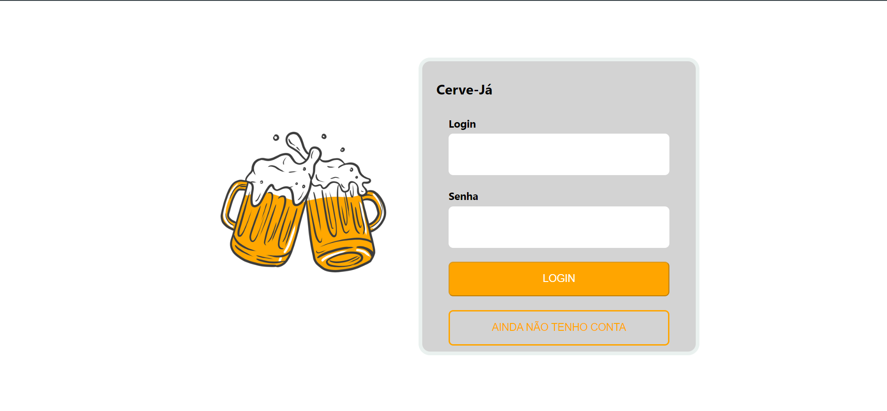

<h1 align="left">Cerve-Já</h1>

###

<p align="left">Esse aplicativo de delivery de bebidas vem para ajudar na conveniência e facilidade para os consumidores de bebidas. Antes do surgimento desse tipo de aplicativo, muitas vezes era necessário sair de casa e ir até um estabelecimento físico para comprar bebidas, o que poderia ser um processo inconveniente e demorado.<br><br>
Além disso, muitas vezes os consumidores não tinham acesso a uma ampla variedade de bebidas em um único local. Com o aplicativo de delivery de bebidas, os consumidores podem agora escolher entre uma ampla variedade de bebidas em um único lugar, fazer o pedido com apenas alguns toques na tela do celular ou web e receber as suas bebidas diretamente em suas casas. Isso torna o processo de compra de bebidas mais conveniente e rápido, economizando tempo e esforço.</p> 

<br>

> <h2 align="left">Sobre perfis de usuário no Banco de Dados</h2>

<br>

Ao executar `docker-compose`, será criado os 3 perfís de usuários: Administrador, Vendedor e Consumidor.

```JavaScript
[
  {
    email: 'adm@cerveja.com',
    password: 'adm23@',
    role: 'administrator',
  },
  {
    email: 'seller@cerveja.com',
    password: 'seller23@',
    role: 'seller',
  },
  {
    email: 'customer@email.com',
    password: 'customer23@',
    role: 'customer',
  },
],
```

<br>

> <h2 align="left">Telas</h2>

<br>

<table>
  <tr>
    <td width="300px">
      <h2>Login</h2>
      
    </td>
    <td width="300px">
      <h2>Register</h2>
      
    </td>
    <td width="300px">
      <h2>Products</h2>
      
    </td>
  </tr>
  <tr>
    <td  width="300px">
      <h2>Checkout</h2>
      
    </td>
    <td width="300px">
      <h2>Order Details (Client)</h2>
      
    </td>
    <td width="300px">
      <h2>Orders List</h2>
      
    </td>
  </tr>
  <tr>
    <td width="300px">
      <h2>Order Details (Seller)</h2>
      
    </td>
    <td width="300px">
      <h2>User Management (Admin)</h2>
      
    </td>
  </tr>
</table>

<br>

> <h2 align="left">Tecnologias utilizadas</h2>

<br>

<div align="left">
  
    
  
  
  
  
  
  
  
</div>